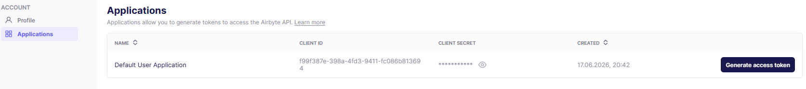

# Airbyte API

API Docs: <https://reference.airbyte.com/reference/getting-started>

Neben der Verwendung von Airbyte über die UI, ist auch eine programmatische Interaktion mit Airbyte möglich.
Es kann zum Beispiel in Kombination mit Orchestrierungstools wie Airflow genutzt werden.
Im Folgenden sollen die ersten Schritte beschrieben werden. (siehe auch: <https://docs.airbyte.com/platform/using-airbyte/configuring-api-access>)

## 1. Access Token holen ##

Die Endpunkte der Airbyte Public API sind gesichert und erfordern eine Authentifizierung mittels **Bearer Token**.
Um dieses Token zu erhalten, muss zunächst über User-->Application zu den Applications navigiert werden.
Dieses repräsentiert in Airbyte einen einzelnen Benutzer anhand einer Client-ID und eines Client Secrets.
Falls defaultmäßig noch keine Application vorhanden ist, muss über "Create an application" eine neue Anwendung erstellt werden.

**Es gibt zwei Möglichkeiten, um an den Access Token zu kommen:**

### Token manuell über die UI holen ###

Bei Applications muss auf "Default User Application" gehovert werden, dann erscheint der Button *"Generate access token"*

**Wichtig: Der Token wird nur einmal angezeigt. Bei Verlust muss ein neuer Key generiert werden.**



### Token über die Kommandozeile holen ###

Mit folgendem Request, kann sich der Token programmatisch geholt werden.

Die **Client-ID** und das **Client-Secret** müssen dafür zunächst aus dem Applications Abschnitt ausgelesen werden.

```bash
curl --request POST \
     --url http://localhost:8000/api/public/v1/applications/token \
     --header 'accept: application/json' \
     --header 'content-type: application/json' \
     --data '{
  "client_id": "<YOUR_CLIENT_ID>",
  "client_secret": "<YOUR_CLIENT_SECRET>",
  "grant-type": "client_credentials"
}'
```

Bei Erfolg hält man einen Response mit dem Access-Token in folgender Form:

```json
{
  "access_token": "<YOUR_ACCESS_TOKEN>",
  "token_type": "Bearer",
  "expires_in": 900
}
```

**Der Token expired nach 15 Minuten. Anschließend muss über die UI oder die Konsole erst ein neuer Token generiert werden.**

## 2. API-Requests ###

Der generierte Access-Token muss anschließend für alle Requests zur Authentifizierung verwendet werden.

**Im Folgenden wird ein GET-Request durchgeführt, um alle Airbyte Source-Connectors aufzulisten.**

```bash
curl --request GET \
     --url 'http://localhost:8000/api/public/v1/sources' \
     --header 'accept: application/json' \
     --header 'authorization: Bearer <YOUR_ACCESS_TOKEN>'
```

**Die Response wird in dieser Form zurückgesendet:**

```json
{
  "data": [
    {
      "sourceId": "f226c273-95cd-4343-b001-f4e1a85e1fb7",
      "name": "HSO Source PostgreSQL",
      "sourceType": "postgres",
      "definitionId": "decd338e-5647-4c0b-adf4-da0e75f5a750",
      "workspaceId": "4f566621-6a5c-464c-9fbd-43651c987e90",
      "configuration": {
        "host": "host.docker.internal",
        "port": 5433,
        "...": "..." 
      },
      "createdAt": 1780234554
    },
    {
      "...": "Weitere Datenquellen wurden zur Übersichtlichkeit gekürzt..."
    }
  ],
  "previous": "",
  "next": "http://localhost:8001/api/public/v1/sources?..."
}
```

Auf diese Weise lässt sich auch Automatisierung umsetzen.

## 4. Objekte per Skript anlegen

Genau das macht [`scripts/airbyte_setup_objects.py`](../scripts/airbyte_setup_objects.py):
es legt die fünf Sources und zwei Destinations über die API an, statt sie in der UI
zusammenzuklicken.

```powershell
python scripts/airbyte_setup_objects.py
```

Der Anlass war ein Datenverlust. Die Airbyte-Konfiguration liegt im kind-Cluster und
überlebt weder `abctl local uninstall` noch das Löschen des Clusters. Der
Datenbank-Stack ist seit Projektbeginn per Skript reproduzierbar, die Airbyte-Seite
war es nicht: nach jedem Neuaufbau mussten alle Connectoren von Hand neu angelegt
werden. Das Skript schließt diese Lücke.

Es ist idempotent. Objekte werden am Namen erkannt, ein zweiter Lauf meldet nur, was
schon vorhanden ist, und ändert nichts.

Die Credentials sucht es der Reihe nach in der Prozessumgebung, in `.env` und zuletzt
über `abctl local credentials`. Im Normalfall muss man also gar nichts konfigurieren.

### Stolpersteine

**`abctl` färbt seine Ausgabe ein.** Wer Client-Id und Secret aus
`abctl local credentials` herausparst, fängt sich ANSI-Escape-Sequenzen ein: in unserer
Ausgabe 80 Stück. Die Werte sind damit acht Zeichen zu lang, und der Token-Endpunkt
antwortet mit einem wenig hilfreichen `Invalid client id or token`, das nach falschen
Zugangsdaten aussieht. Escape-Sequenzen vorher entfernen:

```python
ANSI = re.compile(r"\x1b\[[0-9;]*[A-Za-z]")
sauber = ANSI.sub("", ausgabe)
```

**`tunnel_method` ist Pflicht.** Alle Datenbank-Connectoren verlangen das Feld, auch
wenn kein SSH-Tunnel im Spiel ist. Fehlt es, kommt HTTP 422 mit
`required property 'tunnel_method' not found`. Richtig ist
`{"tunnel_method": {"tunnel_method": "NO_TUNNEL"}}`.

**`grant-type` ist egal.** Der Schreibweise oben (`grant-type` statt des
OAuth-üblichen `grant_type`) muss man nicht nachgehen. Wir haben beide Varianten und
das komplette Weglassen des Feldes getestet, alle drei liefern HTTP 200.

**Beim MySQL-Ziel muss `raw_data_schema` gesetzt sein.** Ohne das Feld legt Airbyte
seine Rohtabellen in einer Datenbank namens `airbyte_internal` an. In MySQL ist ein
Schema eine eigene Datenbank, der Connector müsste sie also anlegen dürfen. `destuser`
darf das nicht:

```
GRANT USAGE ON *.* TO `destuser`@`%`
GRANT ALL PRIVILEGES ON `destdb`.* TO `destuser`@`%`
```

Der Sync scheitert daran auf denkbar unfreundliche Weise. Er läuft vier Versuche lang,
knapp zehn Minuten, und meldet dann `incomplete` mit 0 übertragenen Zeilen. Im Log der
Replikation steht `Destination process exited with non-zero exit code 1`, alles Weitere
(Broken pipe, geschlossene Kanäle) ist Folgefehler. Das Log des Destination-Containers
selbst ist leer. Ohne einen Blick in den kind-Cluster kommt man dem nicht bei:

```powershell
docker exec airbyte-abctl-control-plane kubectl --kubeconfig /etc/kubernetes/admin.conf `
  get pods -n airbyte-abctl
```

Richtig ist `"raw_data_schema": "destdb"`, also dieselbe Datenbank wie die Zieldaten.
Im Zwischenbericht stand das als "Raw-DB `destdb`" schon einmal richtig, war beim
Nachbau über die API aber untergegangen.

**Der Stream-Katalog einer Source ist zwischengespeichert.** Eine Tabelle, die nach der
letzten Erkennung entstanden ist, kennt die API nicht. `POST /connections` antwortet
dann mit HTTP 400:

```
No streams found with name [hso_images] and namespace [null]
```

`GET /streams?sourceId=...` liefert nur den gespeicherten Stand und zeigte bei uns 11
Streams ohne `hso_images`. Die Public API bietet keine Auffrischung an. Es geht über
die interne Config-API:

```
POST /api/v1/sources/discover_schema   {"sourceId": "...", "disable_cache": true}
```

Danach waren es 12 Streams inklusive `hso_images`, und die Connection ließ sich anlegen.
[`scripts/airbyte_setup_connections.py`](../scripts/airbyte_setup_connections.py) ruft
das vor dem Anlegen automatisch auf.

### Was das Skript nicht kann

Einen Verbindungstest. Die Public API stellt dafür keinen Endpunkt bereit, `POST
/sources/<id>/check` antwortet mit 403. Ob ein Connector wirklich funktioniert, zeigt
sich erst beim ersten Sync oder am grünen Haken in der UI.

Die Airbyte-API Doku mit allen möglichen Requests: <https://reference.airbyte.com/reference/getting-started>