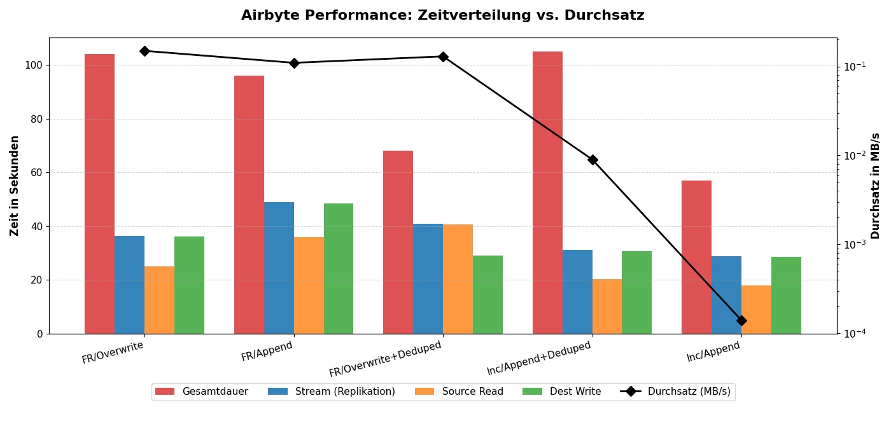

# Call-Notizen & Themensammlung — 16.06.2026

Mitschriften aus dem Call, ausformuliert und thematisch geordnet. Bezieht sich auf
das lokale Airbyte-Setup (`abctl`/kind, Source-PostgreSQL → Ziel-PostgreSQL & MySQL,
Python-Loader für die Source-Befüllung). Siehe auch [architektur.md](architektur.md)
und [airbyte-setup.md](airbyte-setup.md).

Zusammengeführt aus den Mitschriften von Timo, Isabella und Rebecca.

---

## 0. Organisatorisches

- **Kolloquium: Raum B121.**

---

## 1. Sync-Funktionsweise

### Die Phasen eines Syncs
Ein Airbyte-Sync läuft in festen Phasen ab:

1. **Trigger** — Start per Zeitplan (Cron), manuell oder über die API. Zuerst wird
   `check` an Source- *und* Destination-Connector aufgerufen (stehen beide Verbindungen?).
2. **Read (Extract)** — Der Source-Connector liest die Daten; jeder Datensatz wird zu
   einer `AirbyteRecordMessage` (JSON). Der Sync-Modus bestimmt, *was* gelesen wird.
3. **Transfer (Plattform)** — Airbyte puffert und batcht die Records. Hier findet
   **keine** Transformation statt (ELT-Prinzip: Daten bleiben roh).
4. **Write (Load)** — Der Destination-Connector schreibt zunächst in eine
   **Raw-Tabelle** (`_airbyte_raw_…`) mit JSON-Blob + Metadaten (Ladezeit, Hash).
5. **Typing & Deduping** — Die Raw-Daten werden in die finale, typisierte Tabelle
   überführt; bei Dedup-Modus werden Duplikate über den Primary Key entfernt.
6. **State / Checkpoint** — Bei Incremental wird der Fortschritt (z. B. höchster
   `updatedAt`-Wert) gespeichert, auch zwischendurch.

**Lesen findet außerdem parallel zum Schreiben statt**

Airbyte fügt außerdem weitere Airbyte_Metadaten in das Ziel ein bzw. updatet sie:
_airbyte_raw_id, _airbyte_extracted_at und _airbyte_meta, _airbyte_generation_id

> ⚠️ Problem: csv-Import --> Source-DB --> Dest-DB
> schlägt fehl, da Airbyte dann versucht seine Metadaten erneut einzufügen!
> Daher sollte direkt ohne Umwege ins Ziel kopiert werden.
> Problem: durch den fehlenden Cursor stehen nur noch die Full refresh Sync-Methoden zur Auswahl
> Alternative: SQL-View erstellen ohne die Metadaten, dann in Airbyte diese virtuelle Tabelle wählen


### Wird immer alles gesynct?
Hängt vom **Sync-Modus** ab:

| Modus | Liest jedes Mal alles? |
|---|---|
| Full Refresh – Overwrite | **Ja** — Ziel wird geleert und komplett neu geladen |
| Full Refresh – Append | **Ja** — alles wird erneut angehängt (Snapshots/Historie) |
| Incremental – Append | **Nein** — nur Sätze neuer als der Cursor |
| Incremental – Append + Dedup | **Nein** — nur Neues, dedupliziert per PK (häufigster Fall) |

### Wenn ein Sync abbricht
- **Transaktionssicher:** kein halb-importierter, kaputter Zustand in der finalen Tabelle.
- **Automatische Retries:** mehrere Attempts pro Job vor „failed".
  `ToDo:` genaue Anzahl/Logik der Retry-Attempts je Airbyte-Version verifizieren.
- **Checkpointing (nur Incremental):** der nächste Lauf macht ab dem letzten Checkpoint
  weiter, nicht von vorn.
- **Full Refresh:** kein Teil-Aufholen — der nächste Lauf macht alles neu (robust, aber teuer).
- Pro Connection konfigurierbar, ob bei wiederholten Fehlern automatisch deaktiviert wird.

### Paketgröße / Batching
- **Airbyte intern:** Records werden gepuffert und in Batches geschrieben; ein „Flush"
  wird durch Buffer-Größe (RAM/Bytes) **oder** Record-Anzahl ausgelöst. Defaults sind
  connector-spezifisch, in der UI normalerweise nicht gesetzt. Bei self-hosted über
  Memory-Limits (`JOB_MAIN_CONTAINER_MEMORY_*`) indirekt beeinflussbar.
  `ToDo:` Batching-Defaults und ob `JOB_MAIN_CONTAINER_MEMORY_*` der richtige Hebel ist, verifizieren.
- **State-Checkpoint-Intervall:** bestimmt, wie oft der Fortschritt gesichert wird
  (relevant für Wiederaufnahme nach Abbruch).
  `ToDo:` konkrete Checkpoint-Frequenz (z. B. Records pro Checkpoint) und Konfigurierbarkeit verifizieren.
- **In unseren Skripten:** sichtbare Paketgröße = `page_size` bei `execute_values`.
  `load_k_plz.py` nutzt `page_size=1000`; die übrigen Loader nutzen den Default (100)
  → bei großen Tabellen ggf. angleichen.

---

## 2. Connections

### Connections aneinanderreihen / verketten
Airbyte kann Connections **nicht nativ** verketten („B startet, wenn A fertig ist").
Jede Connection hat nur ihren eigenen Zeitplan oder wird manuell/per API getriggert.
Wege für Reihenfolge/Abhängigkeiten:

| Ansatz | Wann sinnvoll |
|---|---|
| Airbyte-API / `abctl`-Skript | Skript triggert Connection 1, wartet auf „succeeded", triggert dann 2. Für wenige Connections völlig ausreichend. |
| Orchestrator (Airflow, Dagster, Prefect) | Viele Schritte mit echten Abhängigkeiten. Für ein Studienprojekt meist Overkill. |
| dbt nach dem Sync | Wenn die zweite Stufe eine Transformation in der Ziel-DB ist (kein weiterer Sync). |

### Custom Code zum Daten-Manipulieren
Airbyte ist **ELT**, nicht ETL — keine freien Code-Snippets mitten im Sync. Möglichkeiten:

| Möglichkeit | Was geht | Was nicht |
|---|---|---|
| Mappings (Connection-UI) ⚠️ **Paid (ab Plus)** | Felder umbenennen, hashen/verschlüsseln, Zeilen filtern | nicht in Core; keine freie Logik / Berechnungen |
| Connector Builder / Low-Code CDK | eigene Quell-Connectoren (Extraktion) | keine Ziel-Transformation |
| dbt (nach dem Load) | beliebige SQL-Transformationen | externes Tool, separat aufzusetzen |

> Unsere Python-Loader (`demojibake`, `normalize`, `generate_account`) sind faktisch
> unsere Custom-Transformation — bewusst **vor** Airbyte, weil die Roh-CSVs unsauber sind.

---

## 3. Eigene Connectoren

### Drei Ebenen (einfach → mächtig)
1. **Connector Builder** (Airbyte-UI, kein Code) — für REST-APIs; direkt in der UI testbar.
2. **Low-Code CDK** (`manifest.yaml`) — deklarativ, versionierbar im Git.
3. **Python CDK** (voller Code) — für Nicht-REST: Datenbanken, SOAP, exotische Formate.

### Aufbau jedes Connectors
Jeder Connector läuft als **Docker-Image** und implementiert vier Kommandos:

| Kommando | Zweck |
|---|---|
| `spec` | Welche Config-Felder braucht der Connector? |
| `check` | Verbindung testen |
| `discover` | Welche Streams/Tabellen + Schema gibt es? |
| `read` | Daten auslesen (als JSON-Stream) |

### Connectoren für APIs
Der Connector Builder reicht für REST-APIs völlig aus. Wichtige Stellen:
Base-URL, Authentication (None/API-Key/Bearer/OAuth2/Basic), Streams (Pfad + Methode),
**Record Selector** (wo im JSON liegen die Daten?), **Pagination**, Schema,
optional **Incremental Sync** über ein Datums-/ID-Feld. Ergebnis als `manifest.yaml`
exportieren und ins Repo legen (z. B. unter `connections/`), damit alle dieselbe
Definition haben.

> Für **Informix** und **SOAP** (offene Quellen) gibt es keine fertigen Connectoren →
> Python CDK oder pragmatisch per eigenem Skript in die Source-DB schreiben.

---

## 4. Monitoring

### Logs
- **Sync-Logs:** 
    - Airbyte-UI → Connection → **Job History** → Sync anklicken → Logs
  (gelesene/geschriebene Zeilen, Fehler, Dauer).
    - Airbyte-UI → Connections → entsprechende Connection anklicken -> Timeline -> auf das Punktemenü rechts neben dem entsprechenden Event klicken -> View Logs (kann auch als .txt Datei gedownloadet werden)
        - Im Header: Attempt wählbar (wenn fehlgeschlagen), Timestamp, Anzahl extracted/geladener records, Job id, Dauer in Sekunden
        - wenn Warning/Fail: Kurzbeschreibung: zum Beispiel: "Failure in source: Checking source connection failed - please review this connection's configuration to prevent future syncs from failing"
        - bietet Suchfunktion, filterbar nach sources (replication-orchestrator, source, destination, platform) und filterbar nach Log levels (info, warn, error, debug, trace)
        - Logfile: enthält weitere nützliche Informationen (zum Beispiel detailliertes Sync summary)
          
          Hier ein beispielhafter Auszug eines erfolgreichen Syncs:

          ```json
          {
            "status" : "completed",
            "recordsSynced" : 1245,
            "bytesSynced" : 363574,
            "startTime" : 1781532526967,
            "endTime" : 1781532557644,
            "totalStats" : {
              "recordsEmitted" : 1245,
              "recordsCommitted" : 1245
              (...)
 
            },
            "streamStats" : [ {
              "streamName" : "fm_stamm"
            } ]
          }
    - Logs über die Airbyte API auszulesen ist aktuell noch nicht möglich (ggf. noch Umwege prüfen)

- **Plattform-Logs:** `kubectl logs -n airbyte-abctl <pod>` (`kubectl get pods -n airbyte-abctl`).
  `ToDo:` echten Namespace-Namen prüfen (`kubectl get namespaces`) — `airbyte-abctl` ist nicht sicher.
- **DB-Logs:** `docker compose logs source-postgres` / `dest-postgres` (`-f` für live).
- **Unsere Skripte:** aktuell nur `print()` auf die Konsole, kein File-Logging.
  → Möglicher Verbesserungspunkt: `logging` mit Zeitstempel + Logfile.

### Performance-Checks
- **Airbyte:** UI zeigt Dauer, Zeilen, Datenvolumen pro Sync. Größter Hebel:
  **Incremental statt Full Refresh**.
    - Aus den Logs lässt sich die Dauer der einzelnen Phasen rauslesen: 
        - **destinationWriteStartTime, destinationWriteEndTime**: Zeitpunkt des Beginns/Endes beim Schreiben in die Ziel-DB
        - **sourceReadStartTime , sourceReadEndTime**: Zeitpunkt des Starts/Endes beim Lesen aus der Quell-DB
        - **replicationStartTime, replicationEndTime**: Zeitpunkt des Starts/Endes des Syncs insgesamt
        - weitere: 
          **meanSecondsBeforeSourceStateMessageEmitted, maxSecondsBeforeSourceStateMessageEmitted**:
          durchschnittliche/ längste Zeitspanne, die der Airbyte Source-Connector warten musste, bis die Source-DB die Daten geliefert hat
          und ein neues Lesezeichen (State Message) in die Pipeline gesendet werden konnte.
          **meanSecondsBetweenStateMessageEmittedandCommitted, maxSecondsBetweenStateMessageEmittedandCommitted**:
          durchschnittliche/ längste gemessene Zeitspanne, die ein Lesezeichen in der Airbyte-Pipeline verbracht hat.
          (zwischen Source-Connector und Destination-Connector)

- **Skripte:** Laufzeit messen (`time.perf_counter()`); `execute_values` (Batch-Insert)
  ist bereits gesetzt; bei Bedarf `page_size` erhöhen.
- **Ziel-DB:** `EXPLAIN ANALYZE` für langsame Abfragen; Indizes prüfen
  (z. B. Index auf `updatedat` in `load_json.py` für den Cursor).

## Performance pro Sync-Strategie:

Zur Evaluation der Full Refresh-Strategien wurde ein Stream mit den Tabellen fm_gebaeude (25 Datensätze) und k_plz (34.172 Datensätze) mit einer Gesamtgröße von 5.331.779 Bytes (~5,33 MB) angelegt.
Für die Incremental-Strategien wird zwingend ein Cursor-Feld benötigt, bei dem neuere Datensätze einen fortlaufend höheren Wert aufweisen. Hierfür wurde zusätzlich ein Datensatz mit 100.000 records (~6,65 MB) erstellt und die Spalte updated_at als Cursor gewählt, um die beiden Hauptstrategien (Full refresh und Incremental) noch besser vergleichen zu können. Dies ermöglichte realistische Simulationsdurchläufe mit minimalen Änderungen, um den Overhead von Airbyte bei kleinen Datenmengen darzustellen.

Alle Daten werden von Source PostgreSQL nach Destination PostgreSQL gesynct.

Timebetween steht dabei für **meanSecondsBetweenStateMessageEmittedandCommitted**, was der durchschnittlichen Latenz im Puffer entspricht.

| Sync mode | Datenmenge | Gesamtdauer Stream (Replication) | Destination Write Time | Source Read Time | TimeBetween | Durchsatz-Geschwindigkeit | Gesamtdauer (bis in UI sichtbar)|
|---|---|---|---|---|---|---|---|
| Full refresh/Overwrite | ~34.200 (5,33 MB) | 36,36 s | 36,18 s | 25,1 s | 11 s | 0,14 MB/s | 104 s |
| Full refresh/Append | ~34.200 (5,33 MB) | 48,88 s| 48,4 s | 36,0 s | 17 s | 0,11 MB/s |96 s |
| Full refresh/Overwrite + Deduped | ~34.200 (5,33 MB) | 40,93 s | 29,07 s | 40,57 s | 16 s| 0,13 MB/s| 68 s|
| Incremental/Append + Deduped | 75.000 (~5,11 MB) | 82,47s | 82,08s | 40,23s | 16 s | 0,06176 MB/s | 82,66s |
| Incremental/Append | 75.000 (~5,11 MB) | 39,67s | 27,96s  | 39,47s | 11s | 0,12818 MB/s | 39,83s |
| Full refresh/Overwrite | 100.000 (~6,65 MB) | 38,08 s | 25,66 s | 37,70 s  | 12s | 0,175 MB/s | 38,24 s |




Die Messreihen verdeutlichen, dass Airbyte, unabhängig vom Datenvolumen, einen erheblichen initialen Overhead aufweist.
Die Gesamtlaufzeit wird stark von diesem Overhead dominiert. In der Folge erweisen sich Incremental-Strategien bei sehr kleinen Datenmengen als relativ ineffizient: Selbst wenn nur 13 Datensätze übertragen werden, beträgt die reine Stream-Dauer (Replikationszeit) fast 30 Sekunden, was die Gesamtdauer künstlich verlängert.
Außerdem fällt auf, dass die Gesamtdauer der Streams von 10-20.000 geänderten Datensätzen nahezu stagniert. (ca. 30 Sekunden).
Bei größeren, sich regelmäßig änderenden Datensätzen ist die Incremental Strategie jedoch sinnvoll, um das Netzerk vor Überlastung zu schützen und die Performance insgesamt zu erhöhen.
Die Strategie: **Incremental/Append** weißt insgesamt die geringste Streamdauer (Replication) und geringste Gesamtdauer insgesamt auf.


(TODO: Auswahl der Sync-Modes pro (realer) Tabelle)

---

## 5. SDK, Marketplace & Ideen

### SDK anschauen / testen
Das Python-CDK ist nur für **Nicht-REST**-Quellen nötig. Für APIs ist der Connector
Builder schneller und ohne lokales Setup. SDK-Einstieg lohnt sich gezielt für
Informix/SOAP.

### Kostet der Marketplace?
**Nein.** Airbyte OSS (unser `abctl`-Setup) und **alle** Connectoren (Certified wie
Community/Marketplace) sind kostenlos. Kostenpflichtig sind nur die **Cloud-/Paid-Tiers**
(siehe Editionen in Abschnitt 6). Kosten können höchstens auf Seiten der **Quelle**
entstehen (bezahlte API-Tiers).

### Creative Connections (Demo-Ideen)
Externe Live-Daten als Ergänzung zu den HSO-Daten — ideal: freie APIs **ohne Key**:

| Thema | API | Key nötig? |
|---|---|---|
| Börsen/Finanzen | Frankfurter (EZB-Wechselkurse) | nein |
| Krypto | CoinGecko | nein (rate-limited) |
| Aktien | Alpha Vantage / Finnhub | ja (free tier) |
| Green IT / Energie | Energy-Charts (Fraunhofer ISE) | nein |
| Wetter/Solar | Open-Meteo | nein |
| Strommarkt EU | ENTSO-E / Electricity Maps | ja |

> Empfehlung für eine Demo: Frankfurter (Wechselkurse) **oder** Energy-Charts (Green IT)
> im Connector Builder nachbauen — beide ohne Key, ~10 Min., zeigt externe Daten im Fluss.

`ToDo:` „Key nötig?"-Spalte vor der Nutzung prüfen — API-Bedingungen/Rate-Limits können
sich ändern (v. a. Energy-Charts, CoinGecko, Frankfurter).

---

## 6. Weitere thematisch sinnvolle Punkte (ergänzt)

Diese kamen im Call nicht explizit vor, gehören aber sachlich dazu und sind für die
nächsten Schritte relevant:

- **CDC vs. Cursor:** Wir nutzen bewusst Cursor (`updatedat`) statt CDC/Xmin, um
  zusätzliche WAL-/Replication-Konfiguration zu vermeiden (siehe
  [architektur.md §5](architektur.md)). CDC erkennt auch *Löschungen* — Cursor nicht.
  Für eine vollständige Sync-Strategie-Doku relevant.
- **Schema-Änderungen (Schema Drift):** Wenn sich Quellspalten ändern, kann Airbyte
  pro Connection automatisch propagieren oder den Sync zur Bestätigung anhalten —
  Verhalten sollte bewusst gesetzt werden.
  `ToDo:` genaue Optionen/Bezeichnungen im Connection-Setting eurer Version prüfen.
- **Scheduling:** Sync-Intervall pro Connection (Cron) vs. manueller/API-Trigger —
  zusammen mit dem Verkettungs-Thema (Abschnitt 2) zu entscheiden.
- **Idempotenz:** Unsere Loader sind idempotent (`TRUNCATE` + Reload); bei Airbyte
  übernimmt das der Sync-Modus (Overwrite vs. Append+Dedup).
- **Sicherheit:** Secrets nur in `.env` (gegitignored), nicht in `manifest.yaml`
  committen; bei API-Connectoren Keys über Config-Felder, nie hartkodiert.
- **Versionierung der Connectoren:** Builder-Ergebnisse als `manifest.yaml` ins Repo,
  damit das Setup reproduzierbar und im Team gleich ist.

### Airbyte-Angebot: Free vs. Paid (Editionen)
Relevant ist die Produktlinie **„Data Replication"** (es gibt daneben „Airbyte Agents",
ein separates KI-Produkt — für uns nicht relevant). Wir nutzen die **kostenlose,
self-hosted** Edition **Core** (`abctl`/kind).
Stand: airbyte.com/pricing, abgerufen 16.06.2026 — Preise können sich ändern.

| Edition | Kosten | Hosting | Preismodell |
|---|---|---|---|
| **Core** (Open Source) | **kostenlos** | self-hosted (unser `abctl`-Setup) | keine Nutzungsgrenzen |
| **Standard** | ab **$10/Monat** | Cloud (managed) | volumenbasiert (nach bewegtem Datenvolumen) |
| **Plus** | ab **$500/Monat** | Cloud (managed) | volumenbasiert + Credit-System (50 Credits inkl.) |
| **Pro** | individuell | Cloud (managed) | kapazitätsbasiert (Data Workers) |
| **Enterprise Flex** | individuell | Cloud (managed) | kapazitätsbasiert |

**Was in der kostenlosen Edition (Core) enthalten ist:**
- **600+ Connectoren** — keine Paywall
- **Change Data Capture (CDC)** und **Schema-Propagation**
- Connector Builder, Low-Code & Python CDK
- Alle Sync-Modi (Full Refresh, Incremental, Dedup), Scheduling, API
- Keine Nutzungs-/Volumengrenzen

**Was nur in den Paid-Tiers dazukommt:**
- **Managed Hosting** (kein eigener Betrieb nötig) — ab *Standard*
- **15-Minuten-Syncs** und **Custom Mappings** — ab *Plus* ⚠️ (Mappings sind **nicht** in Core!)
- **SSO, RBAC, mehrere Workspaces, Governance, Premium-Support** — ab *Pro*
- **Erweiterte Data Governance, mehrere Daten-Regionen, Priority-Support** — *Enterprise Flex*

> **Fazit für uns:** Funktional reicht **Core** vollständig aus — sogar CDC und alle
> 600+ Connectoren sind kostenlos. Der Paid-Mehrwert liegt im Betrieb (Managed Hosting,
> Support, Governance) und in Komfort-Features (Custom Mappings, 15-Min-Syncs), nicht in
> den Connectoren oder Kern-Sync-Funktionen.

### Anwendungen / Anwendungsfälle
Wofür der Data-Hub konkret genutzt werden kann:

- **Datenkonsolidierung:** verteilte Hochschulquellen (Studierende, Gebäude, Institute,
  Personal, PLZ) in ein gemeinsames Zielsystem zusammenführen.
- **Reporting/Analytics:** konsolidierte Ziel-DB als Basis für Auswertungen/Dashboards.
- **Migration/Sync zwischen Systemen:** PostgreSQL ↔ MySQL als Destination-Vergleich.
- **Anreicherung mit externen Daten:** freie APIs (Wechselkurse, Green-IT/Energie) als
  zusätzliche Streams (siehe Abschnitt 5).

---

## 7. Offene Aufgaben / To-dos

- [ ] **Architektur-Diagramm** als richtiges Bild erstellen (statt ASCII) — Deliverable
      aus dem Prof-Feedback.
- [ ] **Sync-Strategie-Doku** (Modi pro Tabelle, CDC vs. Cursor, Fehlerverhalten) —
      offenes Deliverable.
- [ ] Sync-Modus **pro Tabelle** festlegen (Full Refresh vs. Incremental+Dedup) und in
      `connections/` dokumentieren.
- [x] Performance messen für die verschiedenen Sync-Modi bei größeren und kleineren Datensätzen
- [ ] **Informix / SOAP**: Custom-Connector (Python CDK) vs. Skript-in-Postgres entscheiden.
- [x] **Airbyte Free vs. Paid** ausarbeiten — erledigt (siehe Abschnitt 6, Stand 16.06.2026).
- [ ] **File-Logging** in den Loadern statt `print()` (optional).
- [ ] `page_size` in `load_json.py` und `load_fm_gebaeude.py` angleichen (optional).
- [ ] Optional: Demo-Connector für eine freie API (Frankfurter / Energy-Charts).
