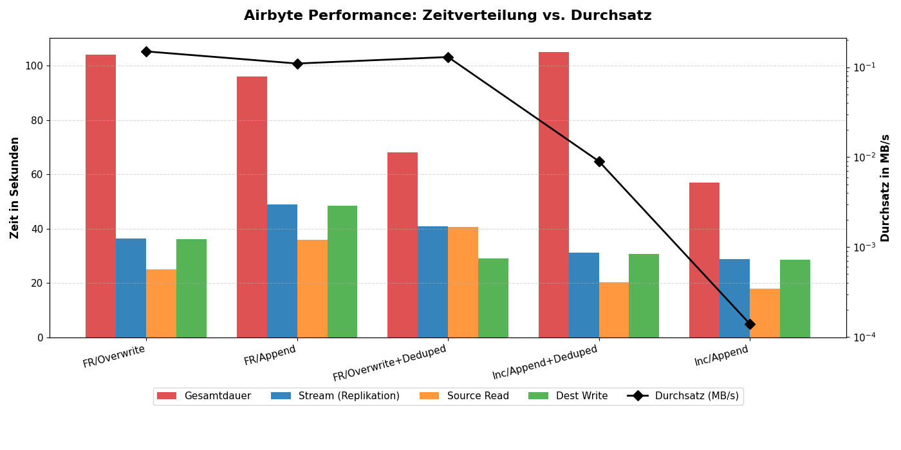
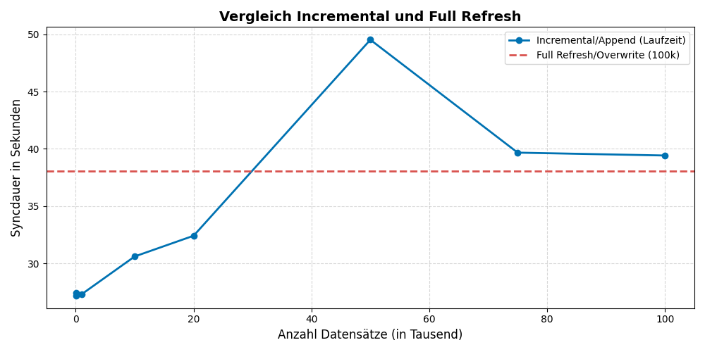

# Performance von Airbyte

Zuerst geht es um allgemeine Besonderheiten bezüglich der Performance von Airbyte.
Anschließend werden experimentelle Performanceanalysen aufgezeigt, welche die verschiedenen Syncstrategien gegenüberstellt und insbesondere den Overhead durch die Containisierung verdeutlicht.

## Allgemeine Performance von Airbyte

### Faster Sync Speed
  - Für einige Connectoren bietet Airbyte diesen Modus an
  - 4- bis 10 mal schneller als zuvor
  - 17% bis 25% weniger CPU- und Arbeitsspeicher-Ressourcen werden verbraucht
  - Hierzu müssen aber in einer Connection sowohl Source- als auch Destination-Connector beide jeweils diesen Modus unterstützen
  - Aktuell werden nur **Source-Connector**: MySQL, **Destination-Connector**: S3, Azure Blob Storage, BigQuery, ClickHouse unterstützt

### Skalierbarkeit und Flexibilität der Infrastruktur
  - Airbyte läuft modular in Containern (Jeder Sync läuft als eigener Docker-Container)
  - Große **Ausfallsicherheit** durch die Containisierung und der damit verbundenen starken Prozessisolierung
  - **Flexibilität und Skalierbarkeit** durch Entkoppelung von Quelle und Ziel
  - Performanceverbesserung bei großen Datenmengen durch **horizontale Skalierung** von Kubernetes
    - Hochsetzen der Limits für CPU und Arbeitsspeicher für die Hauptprozesse
    - Konfiguration der Worker-Replikate und der maximalen Sync-Workers für mehr Parallelität
    - Airbyte kann auch Daten komprimieren um eine bessere Netzwerkbandbreite und geringere Transferkosten zu erreichen
  - Reduzierung des Datenvolumens durch Wahl der richtigen Sync-Strategie (siehe auch Performancetests)
  - teilweise **höhere Latenz** (Besonders auffällig bei kleinerer Datenlast)
      - Container-Start und Orchestrierung (Quell- und Ziel-Container hochfahren, initialisieren, Verbindung validieren und Container nach Job wieder herunterfahren)
      - Protokoll-Overhead
          - Kommunikation basiert auf dem Airbyte Protocol, diese nutzt serialisierte JSON-Nachrichten für die Interprozesskommunikation
          - Quelle muss jeden Datensatz auslesen und in eine JSON Struktur (AirbyteRecordMessage) umwandeln (serialisieren), Airbyte gibt es weiter an STDIN des Ziels, dieser muss es wieder deserialisieren, usw.
      - Transaktions-Batching im Zielsystem
      - Checkpointing und Sicherheitshandshakes mit Statemessages (siehe: Qualitätssicherung: State Messages)
      - Overhead durch JSON-Schema-Validierung besonders bei sehr breiten Tabellen
      - Breite Tabellen (=viele Spalten) belasten außerdem den Arbeitsspeicher stark

## Experimentelle Performanceanalyse von Airbyte

### Testvorbereitung: 

Zur Evaluation der **Full Refresh-Strategien** wurde ein Stream mit den Tabellen fm_gebaeude (25 Datensätze) und k_plz (34.172 Datensätze) mit einer Gesamtgröße von 5.331.779 Bytes (~5,33 MB) angelegt.

Für die **Incremental-Strategien** wird zwingend ein Cursor-Feld benötigt, bei dem neuere Datensätze einen fortlaufend höheren Wert aufweisen. Die bereits existente Tabelle: *hso_students* hat ideale Bedingungen für die Incremental-Strategien. Da sie jedoch nur einen sehr kleinen Datensatz von ca. 5.000 Zeilen enthält ist sie für die Tests nicht weiter geeignet. Daher wurde zusätzlich ein Datensatz mit 100.000 records (~6,65 MB) erstellt und die Spalte updated_at als Cursor gewählt, um die beiden Hauptstrategien (Full refresh und Incremental) noch besser vergleichen zu können. Hierfür wurde die Datei "sql/source/data/hso_students_large.csv" angelegt. Dies erlaubt inkrementelle Tests mit einer steigenden Anzahl geänderter Datensätze, um realistische Simulationsdurchläufe durchführen zu können.

Alle Daten werden von Source PostgreSQL nach Destination PostgreSQL gesynced.

Timebetween steht dabei für **meanSecondsBetweenStateMessageEmittedandCommitted**, was der durchschnittlichen Latenz im Puffer entspricht.

### 1. **Vergleich der Sync-Modes**

In einem ersten Test sollen **alle Sync-Strategien mit jeweils einer ähnlichen Datenlast verglichen** werden und dabei auch der Overhead von Airbyte näher untersucht werden.
Für die Full refresh Methoden wurden jeweils leicht unterschiedliche Daten verwendet wie für die Incremental Strategien (siehe Testvorbereitung).

| Sync mode | Datenmenge | Gesamtdauer Stream (Replication) | Destination Write Time | Source Read Time | TimeBetween | Durchsatz-Geschwindigkeit | Gesamtdauer (bis in UI sichtbar)|
|---|---|---|---|---|---|---|---|
| Full refresh/Overwrite | ~34.200 (5,33 MB) | 36,36 s | 36,18 s | 25,1 s | 11 s | 0,14 MB/s | 104 s |
| Full refresh/Append | ~34.200 (5,33 MB) | 48,88 s| 48,4 s | 36,0 s | 17 s | 0,11 MB/s |96 s |
| Full refresh/Overwrite + Deduped | ~34.200 (5,33 MB) | 40,93 s | 29,07 s | 40,57 s | 16 s| 0,13 MB/s| 68 s|
| Incremental/Append + Deduped | 75.000 (~5,11 MB) | 82,47s | 82,08s | 40,23s | 16 s | 0,06176 MB/s | 82,66s |
| Incremental/Append | 75.000 (~5,11 MB) | 39,67s | 27,96s  | 39,47s | 11s | 0,12818 MB/s | 39,83s |
| Full refresh/Overwrite | 100.000 (~6,65 MB) | 38,08 s | 25,66 s | 37,70 s  | 12s | 0,175 MB/s | 38,24 s |

### 2. **Performance der Incremental/Append Strategie mit unterschiedlicher Datenlast**

In einem zweiten Test soll außerdem untersucht werden, wie sich die **Performance der Incremental/Append Strategie**
bei einer aufsteigenden (geänderten) Datenlast verhält und wie sich dies zur Full refresh/Overwrite Methode unterscheidet, bei der der gesamte Datensatz unabhängig seiner Änderungen gesynced wird.

| Sync mode | Datenmenge | Gesamtdauer Stream (Replication) | Source Read Time  | Destination Write Time| TimeBetween | Durchsatz-Geschwindigkeit | Gesamtdauer (bis in UI sichtbar)|
|---|---|---|---|---|---|---|---|
| Full refresh/Overwrite | 100.000 (~6,65 MB) | 38,08 s | 25,66 s | 37,70 s  | 12s | 175 KB/s | 38,24 s |
| Incremental/Append | 10 (~0,61 kB) | 27,42 s | 16,62 s  | 27,17 s | 10s |  0,022 KB/s| 27,56s |
| Incremental/Append | 100 (~6,23 kB)|  27,20 s | 16,57 s  | 26,93 s | 10 s  | 0,228 KB/s| 27,35 s |
| Incremental/Append | 1.000 (~64,24 kB) | 27,30 s | 16,70 s  | 27,07s  | 10 s | 2,34 KB/s | 27,46 s |
| Incremental/Append | 10.000 (~661,90 kB) | 30,60s | 19,67s  | 30,34s  | 10s | 21,52 KB/s | 30,76s |
| Incremental/Append | 20.000 (~1.345,50 kB) | 32,41s  | 21,48s  | 32,15s | 10s | 41,300 KB/s | 32,58s  |
| Incremental/Append | 50.000 (~3.396,28 kB) | 49,53s | 35,70s  | 47,57s  | 10s | 68,380 KB/s  | 49,67s |
| Incremental/Append | 75.000 (~5.105,26 kB) | 39,67s | 27,96s  | 39,47s | 11s | 128,180 KB/s | 39,83s |
| Incremental/Append | 100.000 (~6.814,25 kB) | 39,42s |  26,80s | 39,13s  | 10s | 172,08 KB/s | 39,60s |

Ein initialer Sync mit dem Mode: **Incremental** entspricht einem **Full refresh**

### Auswertung

Die Messreihen verdeutlichen, dass Airbyte, unabhängig vom Datenvolumen, einen erheblichen **Overhead** aufweist.
Die Gesamtlaufzeit wird stark von diesem Overhead dominiert. In der Folge erweisen sich Incremental-Strategien bei sehr kleinen Datenmengen als relativ ineffizient bezüglich der Zeitdauer des Syncs: Selbst wenn nur 13 Datensätze übertragen werden, beträgt die reine Stream-Dauer (Replikationszeit) fast 30 Sekunden, was die Gesamtdauer künstlich verlängert.
Außerdem fällt auf, dass die Gesamtdauer der Streams von 10-20.000 geänderten Datensätzen nahezu stagniert. (ca. 30 Sekunden).
Bei größeren, sich regelmäßig änderenden Datensätzen ist die Incremental Strategie jedoch dennoch sehr sinnvoll, um das Netzwerk vor Überlastung zu schützen und die Performance insgesamt zu erhöhen.

Das die Full Refresh teilweise sogar schneller ist liegt daran, dass hier komplexe und rechenintensive Operationen wegfallen, die bei den anderen Strategien notwendig sind. Beispielsweise muss für die Append Strategie im Ziel nach Duplikaten anhand des Primärschlüssels gesucht werden, um die alten Zeilen zu bereinigen. Für Full Refresh wird die ganze Tabelle im Ziel einfach komplett verworfen und mit den neuen Daten überschrieben. Außerdem kann anders wie bei den Incremental-Strategien, der State komplett ignoriert werden.  

Die Strategie: **Incremental/Append** weißt insgesamt die geringste Streamdauer (Replication) auf.
Außerdem ist nicht nur die Größe entscheidend, sondern auch die Anzahl der Spalten einer Tabelle.
Bei einer höheren Anzahl an Spalten und nahezu äquivalenter Gesamtgröße dauert der Stream insgesamt dennoch länger.
Bewährte Strategien sind hierbei: Die Verwendung von Skinny Tables und Vertikale Partitionierung.

---
